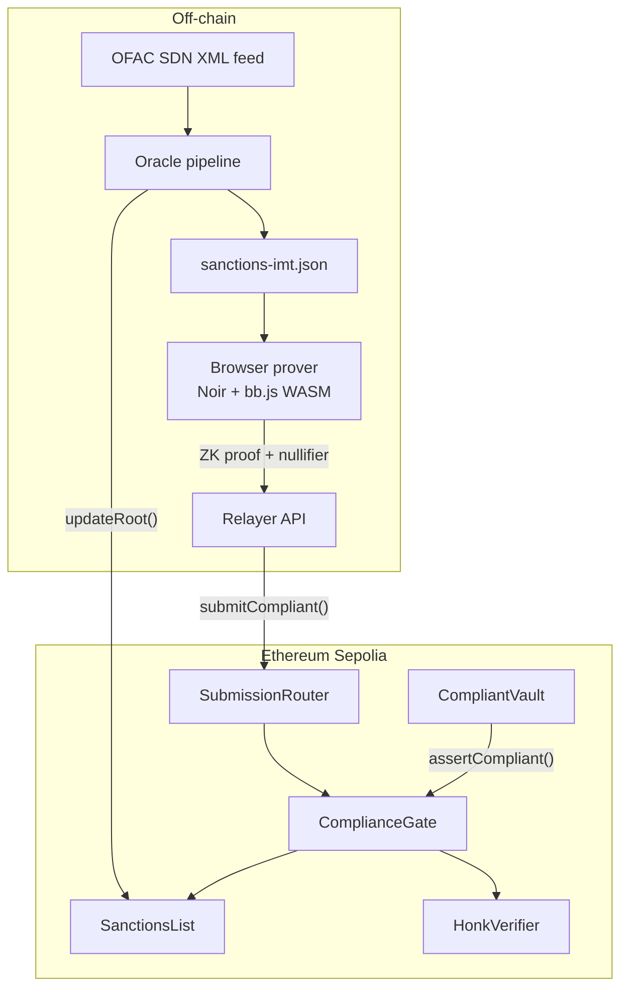
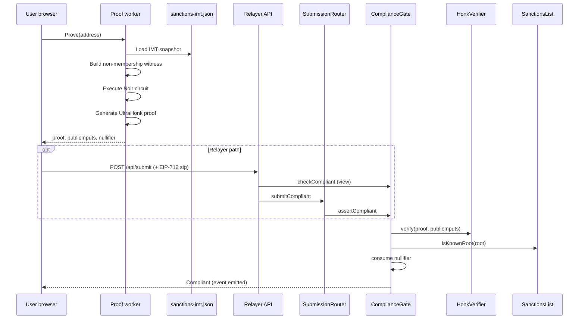
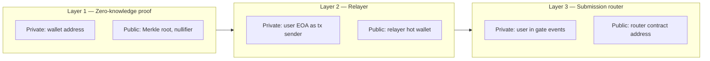
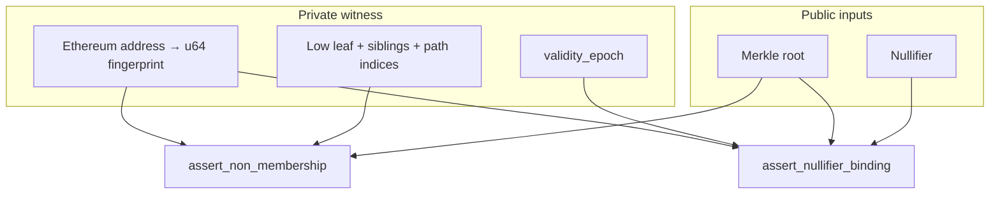
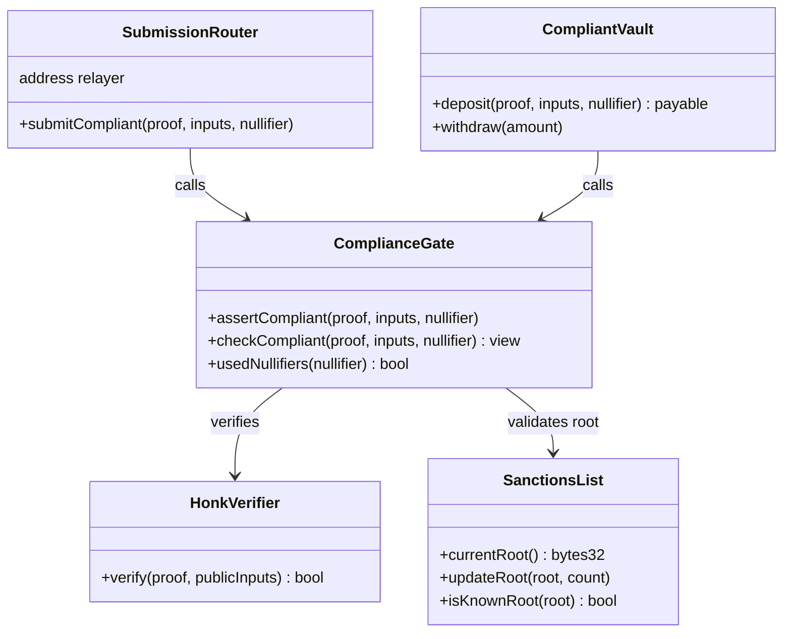
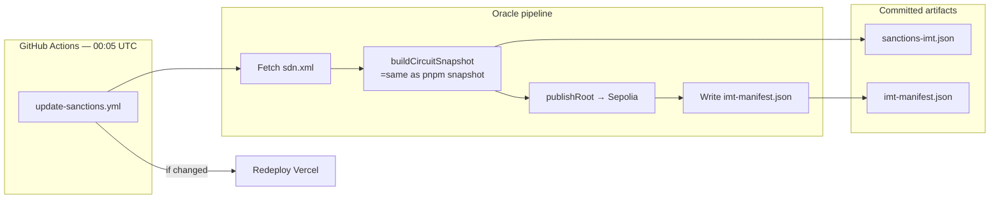
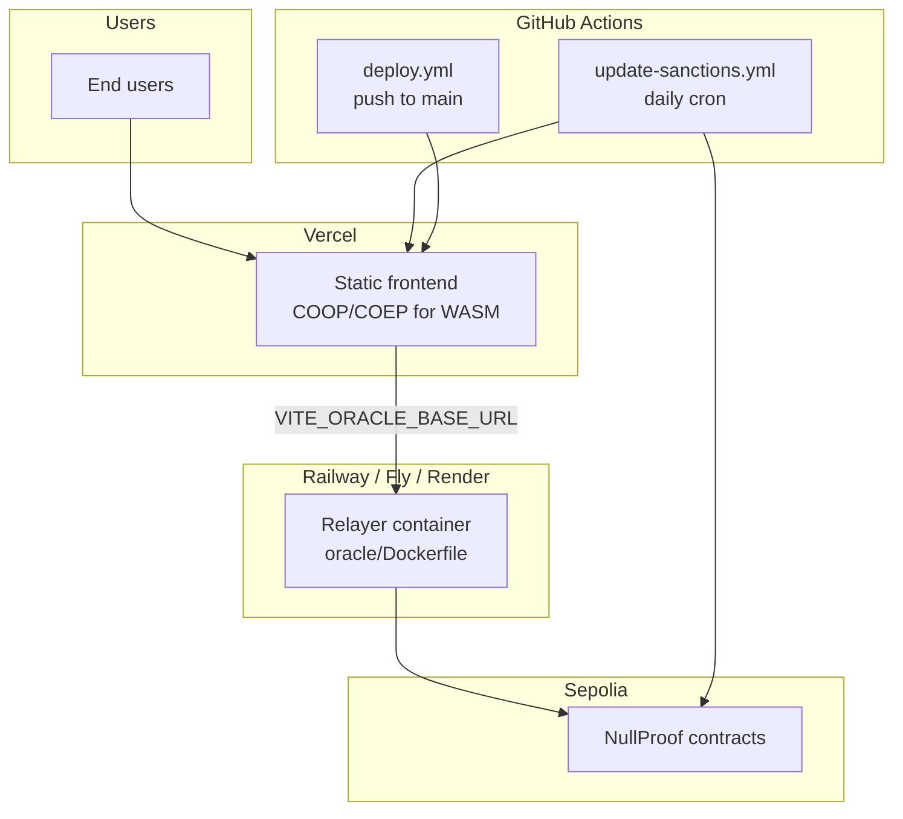

# NullProof

**Prove OFAC non-membership without revealing your wallet address.**

NullProof is a zero-knowledge compliance layer for Ethereum. A user generates a cryptographic proof in the browser that their address is absent from the U.S. Treasury OFAC SDN sanctions list. The proof is verified on-chain through a `ComplianceGate` contract that DeFi protocols can integrate into deposits, swaps, and other gated flows. The wallet address never appears in transaction calldata or on a public block explorer when submitted through the relayer.

The system spans a Noir circuit, UltraHonk verifier contracts, a live OFAC ingestion pipeline, a privacy-preserving relayer, and a production React frontend with in-browser proving via Barretenberg WASM.

---

## Demo

<!-- Replace VIDEO_ID with your YouTube video ID after upload -->

| | |
|---|---|
| **Video** | `https://www.youtube.com/watch?v=YP0X0sK0GME` |
| **Thumbnail** | `[](https://www.youtube.com/watch?v=YP0X0sK0GME)` |
| **Live app** | `https://nullproof-mocha.vercel.app` |
| **Verified submission** | `https://sepolia.etherscan.io/tx/0xc84cc16c43044974d6ec15cc25dc4365f67f9071b978faeebf6fc6219423c928` |


---

## The Problem

Financial protocols operating in regulated jurisdictions must screen users against sanctions lists. The standard approach exposes the user's wallet address to the protocol, relayers, indexers, and anyone reading chain data. That creates a permanent, linkable record of who attempted to use a service.

NullProof inverts the trust model: the protocol learns only that *some* compliant user passed verification, not *which* address proved compliance.

---

## Solution Overview



| Capability | Mechanism |
|------------|-----------|
| Non-membership | Indexed Merkle Tree non-membership proof over ~90 sanctioned Ethereum addresses extracted from OFAC SDN |
| Address privacy | Wallet address is a private circuit witness; only Merkle root and nullifier are public inputs |
| Submission privacy | Relayer broadcasts via `SubmissionRouter`; user EOA is not the on-chain `tx.from` |
| Replay protection | Poseidon-derived nullifier bound to `(address, root, validity_epoch)` and consumed on-chain |
| Freshness | Oracle publishes a new Merkle root daily when the OFAC list changes; proofs expire after a configurable window (default 24 hours) |

---

## Proof Lifecycle



**Public inputs exposed on-chain:** Merkle root of the sanctions tree, nullifier hash.  
**Never exposed on-chain:** The user's Ethereum address.

---

## Privacy Architecture

NullProof applies privacy in three independent layers. Each layer removes a different identifier from public view.



| Layer | What stays hidden | How |
|-------|-------------------|-----|
| ZK circuit | Wallet address in calldata | Address encoded as a `u64` witness; only root and nullifier are public |
| Relayer | User EOA on Etherscan | Relayer wallet pays gas and signs the router transaction |
| Router | User in `NullifierConsumed` events | `ComplianceGate` sees `msg.sender` as the router contract |

Phase 1 optionally requires an off-chain EIP-712 `AuthorizeNullifier` signature so the relayer can authenticate requests without publishing the signer on-chain. After nullifier binding is enforced in-circuit, relayer auth can be disabled (`REQUIRE_RELAYER_AUTH=false`).

See [`docs/privacy-architecture.md`](docs/privacy-architecture.md) for the full threat model and deployment checklist.

---

## Technology Stack

| Layer | Technology |
|-------|------------|
| ZK circuit | [Noir](https://noir-lang.org/) (`nargo`), Indexed Merkle Tree non-membership, Poseidon hashing |
| Proving system | [Barretenberg](https://github.com/AztecProtocol/barretenberg) UltraHonk (`@aztec/bb.js` WASM in browser) |
| Smart contracts | Solidity 0.8.24, Foundry, OpenZeppelin, auto-generated `HonkVerifier` |
| Frontend | React 18, TypeScript, Vite, wagmi, Reown AppKit, Web Worker proving |
| Oracle | Node.js 20, ethers v6, fast-xml-parser, circuit-aligned snapshot builder |
| Relayer API | Hono, `@hono/node-server`, EIP-712 recovery |
| CI/CD | GitHub Actions (typecheck, Foundry tests, Vercel deploy, daily sanctions cron) |
| Hosting | Vercel (frontend), Railway / Fly.io / Render (relayer container) |

---

## Repository Structure

```
nullproof/
├── circuit/                 # Noir non-membership circuit + nargo tests
├── contracts/               # Solidity: gate, sanctions list, router, vault, verifier
│   ├── src/
│   ├── test/                # 83 Foundry tests
│   └── script/Deploy.s.sol
├── frontend/                # React app, in-browser prover, OFAC snapshot builder
│   ├── public/circuits/     # Compiled bytecode + WASM artifacts
│   ├── public/data/         # sanctions-imt.json, imt-manifest.json
│   └── scripts/build-snapshot.ts
├── oracle/                  # Root publisher + relayer HTTP API
│   ├── src/
│   └── Dockerfile           # Production relayer image
├── docs/                    # Architecture and deployment notes
├── scripts/                 # Circuit build, ABI sync, benchmarks
└── .github/workflows/       # ci.yml, deploy.yml, update-sanctions.yml
```

---

## Circuit Design

The Noir circuit (`circuit/src/main.nr`) proves two statements in a single proof:

1. **Non-membership** — the user's address value lies strictly between two consecutive leaves in a sorted Indexed Merkle Tree of sanctioned addresses, therefore it is not a sanctioned entry.
2. **Nullifier binding** — `nullifier = Poseidon(query_value, root, validity_epoch)`, tying the proof to a specific address, snapshot, and time window without revealing the address.



Tree depth is fixed at 20, supporting up to ~1M leaves with sentinel padding. The live OFAC feed currently yields approximately 90 unique Ethereum addresses from 17,600+ total SDN entries (individuals, entities, non-ETH digital currency addresses, and physical locations are excluded).

---

## Smart Contracts

| Contract | Role |
|----------|------|
| `SanctionsList` | Stores the current OFAC Merkle root; authorised oracle wallet calls `updateRoot()` |
| `HonkVerifier` | On-chain UltraHonk proof verification (generated from circuit VK via `bb contract`) |
| `ComplianceGate` | Verifies proofs, checks root freshness, enforces nullifier uniqueness and expiry window |
| `SubmissionRouter` | Relayer-only entry point; decouples end-user identity from gate events |
| `CompliantVault` | Reference integration: atomic `assertCompliant` + ETH deposit |



**Test coverage:** 83 Foundry tests across `ComplianceGate`, `SanctionsList`, `SubmissionRouter`, and `CompliantVault`.

---

## Oracle and Data Pipeline

The oracle keeps the on-chain root synchronized with the official OFAC SDN feed.



Critical invariant: the oracle runs the **same** snapshot builder as the frontend prover (`frontend/scripts/build-snapshot.ts` via `CircuitIMT`). A mismatch between the prover tree and the on-chain root would invalidate every proof.

For local development when `treasury.gov` is unreachable:

```bash
curl -L -o /tmp/sdn.xml https://www.treasury.gov/ofac/downloads/sdn.xml
OFAC_XML_PATH=/tmp/sdn.xml pnpm snapshot
OFAC_XML_PATH=/tmp/sdn.xml pnpm oracle:run
```

---

## Getting Started

### Prerequisites

| Tool | Version |
|------|---------|
| Node.js | ≥ 20 |
| pnpm | ≥ 9 |
| Foundry | latest (`foundryup`) |
| Nargo | ≥ 1.0 beta (for circuit work) |
| Barretenberg CLI | for verifier generation |

### Install

```bash
git clone https://github.com/vamshiganesh/NullProof.git
cd NullProof
pnpm install
```

### Environment

Copy the example env files and fill in values:

```bash
cp frontend/.env.example frontend/.env.local
cp oracle/.env.example oracle/.env
cp contracts/.env.example contracts/.env
```

| File | Purpose |
|------|---------|
| `frontend/.env.local` | Contract addresses, RPC URL, relayer URL, WalletConnect project ID |
| `oracle/.env` | Oracle wallet, relayer key, Sepolia RPC, CORS origin |
| `contracts/.env` | Deployer key, oracle address, verifier address, Etherscan API key |

### Local development (three terminals)

```bash
# Terminal 1 — relayer API
pnpm oracle:api

# Terminal 2 — oracle cron (optional locally; production uses GitHub Actions)
pnpm oracle:run

# Terminal 3 — frontend
pnpm dev
```

Set `VITE_ORACLE_BASE_URL=http://localhost:3001` and `CORS_ORIGIN=http://localhost:3003` (or your Vite port) so the browser can reach the relayer.

### Build and verify

```bash
pnpm typecheck          # TypeScript across frontend + oracle
pnpm build              # Production frontend bundle
pnpm contracts:test     # 83 Foundry tests
pnpm circuit:test       # Noir unit tests
pnpm benchmark          # Proof generation latency report (P50/P95/P99)
```

---

## Production Deployment



| Component | Platform | Key configuration |
|-----------|----------|-------------------|
| Frontend | Vercel | Root directory `frontend`; all `VITE_*` env vars; `frontend/vercel.json` sets COOP/COEP headers |
| Relayer | Docker host | `RELAYER_PRIVATE_KEY`, `SUBMISSION_ROUTER_ADDRESS`, `CORS_ORIGIN` = Vercel URL |
| Daily root update | GitHub Actions | `ORACLE_PRIVATE_KEY`, `SEPOLIA_RPC_URL`, `SANCTIONS_LIST_ADDRESS`, Vercel tokens |
| WalletConnect | [cloud.reown.com](https://cloud.reown.com) | `VITE_WALLETCONNECT_PROJECT_ID` |

GitHub repository secrets for automated deploy:

| Secret | Source |
|--------|--------|
| `VERCEL_TOKEN` | [vercel.com/account/tokens](https://vercel.com/account/tokens) |
| `VERCEL_ORG_ID` | `.vercel/project.json` after `vercel link` |
| `VERCEL_PROJECT_ID` | `.vercel/project.json` after `vercel link` |
| `SEPOLIA_RPC_URL` | Alchemy or Infura Sepolia endpoint |
| `ORACLE_PRIVATE_KEY` | Hot wallet authorised on `SanctionsList` |

Fund the relayer and oracle wallets with Sepolia ETH before going live.

---

## Sepolia Testnet Deployment

Contracts are deployed and verified on Ethereum Sepolia:

| Contract | Address |
|----------|---------|
| ComplianceGate | `0x1906B284ef0DA8Dc41b531bb08E2Ae9eEAAeEA5f` |
| SanctionsList | `0xc4981582b3Fd662F825BcAA943F06F3E91cBb628` |
| HonkVerifier | `0x858993CbAF3F0e7a53e8a3d913cf38C1C7a2Bbc7` |
| SubmissionRouter | `0x094AC492023157c9e2F228e3620e31C249cd3035` |
| CompliantVault | `0x651304b0a0883C882Aa2a9a24E5AAC911AFc829f` |

Explorer links: [ComplianceGate](https://sepolia.etherscan.io/address/0x1906B284ef0DA8Dc41b531bb08E2Ae9eEAAeEA5f) · [SanctionsList](https://sepolia.etherscan.io/address/0xc4981582b3Fd662F825BcAA943F06F3E91cBb628)
Sample verified compliance submission: [Etherscan](https://sepolia.etherscan.io/tx/0xc84cc16c43044974d6ec15cc25dc4365f67f9071b978faeebf6fc6219423c928)

---

## Integration Guide

Protocols integrate compliance by calling `ComplianceGate.assertCompliant` inside their gated function:

```solidity
function deposit(
    bytes calldata proof,
    bytes32[] calldata publicInputs,
    bytes32 nullifier
) external payable {
    complianceGate.assertCompliant(proof, publicInputs, nullifier);
    // ... protocol logic proceeds
}
```

`CompliantVault` is a minimal reference implementation. Production integrations should:

- Call `checkCompliant` off-chain before asking the user to sign a transaction
- Respect the proof validity window (default 24 hours)
- Use the relayer path when address privacy is required
- Never reuse a nullifier across multiple actions (each proof consumption is one-time)

---

## Continuous Integration

| Workflow | Trigger | Purpose |
|----------|---------|---------|
| `ci.yml` | Pull request | Lint, typecheck, Foundry tests, frontend build |
| `deploy.yml` | Push to `main` | Pre-deploy guard, Vercel production deploy, smoke test |
| `update-sanctions.yml` | Daily 00:05 UTC | OFAC fetch, root publish, snapshot commit, conditional redeploy |

---

## Security Considerations

NullProof is a testnet demonstration and research artifact. It is not audited for mainnet production use.

| Topic | Status |
|-------|--------|
| Smart contract audit | Not conducted |
| ZK circuit audit | Not conducted |
| OFAC coverage | Ethereum addresses only (~90 entries); not a complete sanctions screening product |
| Relayer trust | Phase 1 relayer sees EIP-712 signer off-chain; use relayer auth disable only after understanding the tradeoff |
| Key management | Oracle and relayer hot wallets must be funded and rotated if exposed |
| Proof cost | In-browser proving takes tens of seconds depending on hardware; WASM requires COOP/COEP headers in production |

---

## License

MIT
